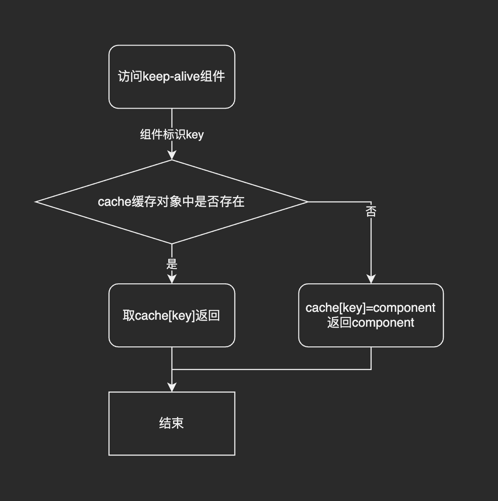
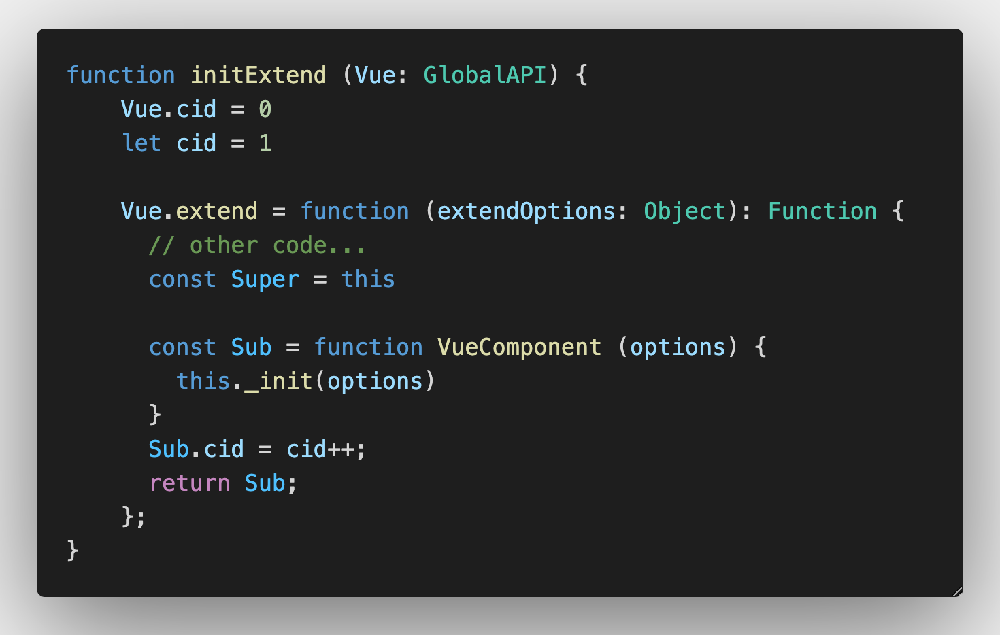
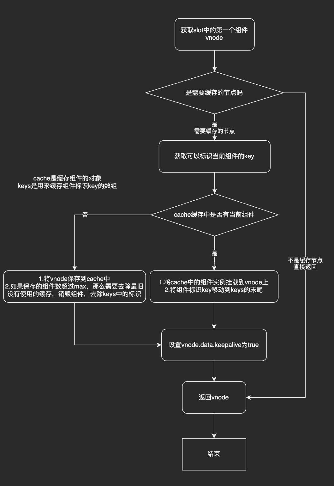

# Vue keep-alive原理
## 1.\<keep-alive>组件的作用
**官方解释：**\<keep-alive> 包裹动态组件时，会缓存不活动的组件实例，而不是销毁它们。

**简单来说其主要作用是保留组件状态和避免重新渲染。**

列子参考官方文档：[动态组件 & 异步组件 — Vue.js (vuejs.org)](https://cn.vuejs.org/v2/guide/components-dynamic-async.html)

## 2.keep-alive组件是怎么实现缓存组件的?
很容易我们可以想到以对象的形式来存储我们需要缓存的组件，
切换组件的时候我们用组件的标识作为索引来对组件存取。
```
interface KeepAliveObj {
    [componentKey: string]: componentInstance
}
```
### 2.1 自己尝试实现一下
组件的标识为key，那么当要渲染\<keep-alive>中的组件的时候，
第一次访问，就去cache中用组件的key作为索引，组件实例化后缓存在对象里面
```cache[key] = component```
将组件缓存，后续的访问，就直接取cache[key]返回


那我们可以用什么作为组件标识的key呢？
我们比较熟悉的是每个组件的实例都有一个uid作为标识，但是由于\<keep-alive>是从组件层面上来做缓存，所以uid并不适合在这里作为key

那么有没有一个id是只标识组件的类的呢？

cid就是这样的一个属性
它定义在vue/src/core/global-api/extend.js里面


可以看到这个cid属性的添加是写在Vue.extend方法里面的，
所以每次注册一个新的组件的时候，它都会调用这个函数，给组件的构造函数添加cid属性

### 2.2 Vue的实现
去看代码的实现逻辑也是差不太多，只不过他加了一些组件是否需要缓存，组件最大缓存数的处理

```
// src/core/components/keep-alive.js
export default {
  name: 'keep-alive',
  abstract: true,

  props: {
    include: patternTypes,
    exclude: patternTypes,
    max: [String, Number]
  },

  created () {
    this.cache = Object.create(null)
    this.keys = []
  },

  destroyed () {
    for (const key in this.cache) {
      pruneCacheEntry(this.cache, key, this.keys)
    }
  },

  mounted () {
    this.$watch('include', val => {
      pruneCache(this, name => matches(val, name))
    })
    this.$watch('exclude', val => {
      pruneCache(this, name => !matches(val, name))
    })
  },

  render () {
    const slot = this.$slots.default
    const vnode: VNode = getFirstComponentChild(slot)
    const componentOptions: ?VNodeComponentOptions = vnode && vnode.componentOptions
    if (componentOptions) {
      const name: ?string = getComponentName(componentOptions)
      const { include, exclude } = this
      if (
        (include && (!name || !matches(include, name))) ||
        (exclude && name && matches(exclude, name))
      ) {
        return vnode
      }

      const { cache, keys } = this
      // 如果组件设置了key则用key，否则用cid和tag标签名
      const key: ?string = vnode.key == null
        // same constructor may get registered as different local components
        // so cid alone is not enough (#3269)
        ? componentOptions.Ctor.cid + (componentOptions.tag ? `::${componentOptions.tag}` : '')
        : vnode.key
      
      // 存在缓存则取出挂载到组件属性实例上
      if (cache[key]) {
        vnode.componentInstance = cache[key].componentInstance
        // make current key freshest
        remove(keys, key)
        keys.push(key)
      } else { // 不存在缓存则需要缓存起来
        cache[key] = vnode
        keys.push(key)
        // prune oldest entry
        if (this.max && keys.length > parseInt(this.max)) {
          pruneCacheEntry(cache, keys[0], keys, this._vnode)
        }
      }

      // 注意这里
      // keepAlive属性用来标识组件是否是keepAlive组件
      // 在组件进行“重新渲染”的时候，会判断这个字段是否为true
      vnode.data.keepAlive = true
    }
    return vnode || (slot && slot[0])
  }
}
```

以下是\<keep-alive>实现缓存的流程图


至此，我们知道了keep-alive实现的原理
但是keep-alive是怎么做到第一次访问的时候调用created, mounted钩子函数
后续的访问是调用activated, deactivated钩子函数呢
我们来看普通组件和keep-alive的渲染流程里有没有对应的特殊处理

## 3.keep-alive组件的渲染流程
### 3.1 首次渲染
Vue 的渲染最后都会到 patch 过程，而组件的 patch 过程会执行 createComponent 方法，它的定义在 src/core/vdom/patch.js 中：
```
function createComponent (vnode, insertedVnodeQueue, parentElm, refElm) {
  let i = vnode.data
  if (isDef(i)) {
    const isReactivated = isDef(vnode.componentInstance) && i.keepAlive
    if (isDef(i = i.hook) && isDef(i = i.init)) {
      i(vnode, false /* hydrating */)
    }
    // after calling the init hook, if the vnode is a child component
    // it should've created a child instance and mounted it. the child
    // component also has set the placeholder vnode's elm.
    // in that case we can just return the element and be done.
    if (isDef(vnode.componentInstance)) {
      initComponent(vnode, insertedVnodeQueue)
      insert(parentElm, vnode.elm, refElm)
      if (isTrue(isReactivated)) {
        reactivateComponent(vnode, insertedVnodeQueue, parentElm, refElm)
      }
      return true
    }
  }
}
```
在createComponent中定义了isReactivated变量，它是根据vnode.componentInstance(是否已经渲染过，有组件实例)以及vnode.data.keepAlive(在keep-alive组件里面的设置)。这里由于是首次渲染，vnode.componentInstance没定义，isReactivated为false，所以keep-alive的组件跟普通组件的初次渲染是一样的。

### 3.2 二次渲染
Vue中在进行diff之前，会执行prepatch钩子函数
它定义在src/core/vdom/create-component中：
```
const componentVNodeHooks = {
  prepatch (oldVnode: MountedComponentVNode, vnode: MountedComponentVNode) {
    const options = vnode.componentOptions
    const child = vnode.componentInstance = oldVnode.componentInstance

    updateChildComponent(
      child,
      options.propsData, // updated props
      options.listeners, // updated listeners
      vnode, // new parent vnode
      options.children // new children
    )
  },
  // ...
}
```
```prepatch``` 核心逻辑就是执行 ```updateChildComponent``` 函数，
它定义在 ```src/core/instance/lifecycle.js``` 中
```
export function updateChildComponent (
  vm: Component,
  propsData: ?Object,
  listeners: ?Object,
  parentVnode: MountedComponentVNode,
  renderChildren: ?Array<VNode>
) {
  const hasChildren = !!(
    renderChildren ||          
    vm.$options._renderChildren ||
    parentVnode.data.scopedSlots || 
    vm.$scopedSlots !== emptyObject 
  )

  // ...
  if (hasChildren) {
    vm.$slots = resolveSlots(renderChildren, parentVnode.context)
    vm.$forceUpdate()
  }
}
```
```updateChildComponent``` 方法主要是去更新组件实例的一些属性，因为```<keep-alive>```组件的缓存的组件是以子组件的形式通过```slot```插槽插入进去的。所以在进行 ```prepatch``` 的时候，需要对它的```chlidren```，即插槽的组件做重新解析。并触发```<keep-alive>```组件实例的 ```$forceUpdate``` 方法，也就是重新调用```<keep-alive>```的```render```方法，这个时候如果命中它缓存中的组件，那么直接取出缓存的组件实例并返回，然后执行```patch```过程，再次执行到```createComponent```方法
```
function createComponent (vnode, insertedVnodeQueue, parentElm, refElm) {
  let i = vnode.data
  if (isDef(i)) {
    const isReactivated = isDef(vnode.componentInstance) && i.keepAlive
    if (isDef(i = i.hook) && isDef(i = i.init)) {
      i(vnode, false /* hydrating */)
    }
    // after calling the init hook, if the vnode is a child component
    // it should've created a child instance and mounted it. the child
    // component also has set the placeholder vnode's elm.
    // in that case we can just return the element and be done.
    if (isDef(vnode.componentInstance)) {
      initComponent(vnode, insertedVnodeQueue)
      insert(parentElm, vnode.elm, refElm)
      if (isTrue(isReactivated)) {
        reactivateComponent(vnode, insertedVnodeQueue, parentElm, refElm)
      }
      return true
    }
  }
}
```
因为这次命中了缓存，```isReactivated```为true，在执行```vnode.init```钩子方法的时候没有组件实例化的过程，而是会直接进行prepatch，相关的逻辑在```src/core/vdom/create-component.js```中
```
const componentVNodeHooks = {
  init (vnode: VNodeWithData, hydrating: boolean): ?boolean {
    if (
      vnode.componentInstance &&
      !vnode.componentInstance._isDestroyed &&
      vnode.data.keepAlive
    ) {
      // kept-alive components, treat as a patch
      const mountedNode: any = vnode // work around flow
      componentVNodeHooks.prepatch(mountedNode, mountedNode)
    } else {
      const child = vnode.componentInstance = createComponentInstanceForVnode(
        vnode,
        activeInstance
      )
      child.$mount(hydrating ? vnode.elm : undefined, hydrating)
    }
  },
  // ...
}
```
执行完```init```钩子方法之后，会执行```reactivateComponent```函数
```
function reactivateComponent (vnode, insertedVnodeQueue, parentElm, refElm) {
  let i
  // hack for #4339: a reactivated component with inner transition
  // does not trigger because the inner node's created hooks are not called
  // again. It's not ideal to involve module-specific logic in here but
  // there doesn't seem to be a better way to do it.
  let innerNode = vnode
  while (innerNode.componentInstance) {
    innerNode = innerNode.componentInstance._vnode
    if (isDef(i = innerNode.data) && isDef(i = i.transition)) {
      for (i = 0; i < cbs.activate.length; ++i) {
        cbs.activate[i](emptyNode, innerNode)
      }
      insertedVnodeQueue.push(innerNode)
      break
    }
  }
  // unlike a newly created component,
  // a reactivated keep-alive component doesn't insert itself
  insert(parentElm, vnode.elm, refElm)
}
```
前面```while```循环部分处理```reactivated```组件```transition```动画不触发的问题，然后通过```insert(parentElm, vnode.elm, refElm)```把缓存的DOM对象直接插入到目标元素中，这样就完成了在数据更新的情况下的渲染过程。

### 3.3 调用```activated```钩子方法
组件在```patch```的最后一步，会调用```invokeInsertHook(vnode, insertedVnodeQueue, isInitialPatch)```函数执行
```vnode```的```init```钩子方法，它定义在 ```src/core/vdom/create-component.js``` 中：
```
const componentVNodeHooks = {
  insert (vnode: MountedComponentVNode) {
    const { context, componentInstance } = vnode
    if (!componentInstance._isMounted) {
      componentInstance._isMounted = true
      callHook(componentInstance, 'mounted')
    }
    if (vnode.data.keepAlive) {
      if (context._isMounted) {
        // vue-router#1212
        // During updates, a kept-alive component's child components may
        // change, so directly walking the tree here may call activated hooks
        // on incorrect children. Instead we push them into a queue which will
        // be processed after the whole patch process ended.
        queueActivatedComponent(componentInstance)
      } else {
        activateChildComponent(componentInstance, true /* direct */)
      }
    }
  },
  // ...
}
```
这里对于 ```keep-alive``` 的组件根据组件实例的 ```_isMounted``` 属性处理方式会不同：如果已经 ```mounted```，执行 ```queueActivatedComponent(componentInstance)``` ，否则执行 ```activateChildComponent(componentInstance, true)```，我们先看非 ```mounted``` 的情况，```activateChildComponent``` 的定义在 ```src/core/instance/lifecycle.js``` 中：
```
export function activateChildComponent (vm: Component, direct?: boolean) {
  if (direct) {
    vm._directInactive = false
    if (isInInactiveTree(vm)) {
      return
    }
  } else if (vm._directInactive) {
    return
  }
  if (vm._inactive || vm._inactive === null) {
    vm._inactive = false
    for (let i = 0; i < vm.$children.length; i++) {
      activateChildComponent(vm.$children[i])
    }
    callHook(vm, 'activated')
  }
}
```
可以看到，这里的处理是触发组件的 ```activated``` 钩子方法和递归调用它子组件```activated``` 钩子方法

再看已经 ```mounted``` 的情况，```queueActivatedComponent``` 的定义在 ```src/core/observer/scheduler.js``` 中：
```
export function queueActivatedComponent (vm: Component) {
  vm._inactive = false
  activatedChildren.push(vm)
}
```
这里的逻辑很简单，就是把组件实例放到```activatedChildren```数组里面，然后等当前组件渲染完成，在 ```nextTick``` 后会执行 ```flushSchedulerQueue``` 
```
function flushSchedulerQueue () {
  // ...
  const activatedQueue = activatedChildren.slice()
  callActivatedHooks(activatedQueue)
  // ...
}

function callActivatedHooks (queue) {
  for (let i = 0; i < queue.length; i++) {
    queue[i]._inactive = true
    activateChildComponent(queue[i], true)  }
}
```
这里也是会遍历 ```activatedChildren``` 数组然后跟非 ```mounted``` 的处理一样，只是通过 ```flushSchedulerQueue``` 把执行时机延后了。然后从这里我们也知道，这个钩子方法是缓存组件被渲染到页面上后才会触发执行的。

另外 ```deactivated``` 钩子方法的调用逻辑和 ```activated``` 调用逻辑差不多，但是它没有延后执行的处理

## 总结
至此，```<keep-alive>``` 的实现原理介绍完了。对于```<keep-alive>``` 是怎么实现缓存、缓存的组件渲染的逻辑、组件钩子方法的触发，我们都了解了。

参考链接：[Vue.js 技术揭秘-组件渲染](https://ustbhuangyi.github.io/vue-analysis/v2/extend/keep-alive.html#%E7%BB%84%E4%BB%B6%E6%B8%B2%E6%9F%93)